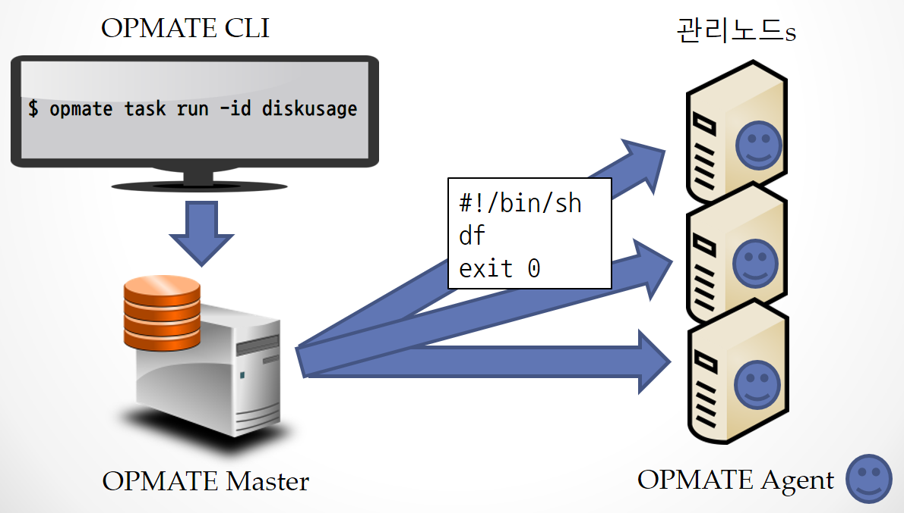
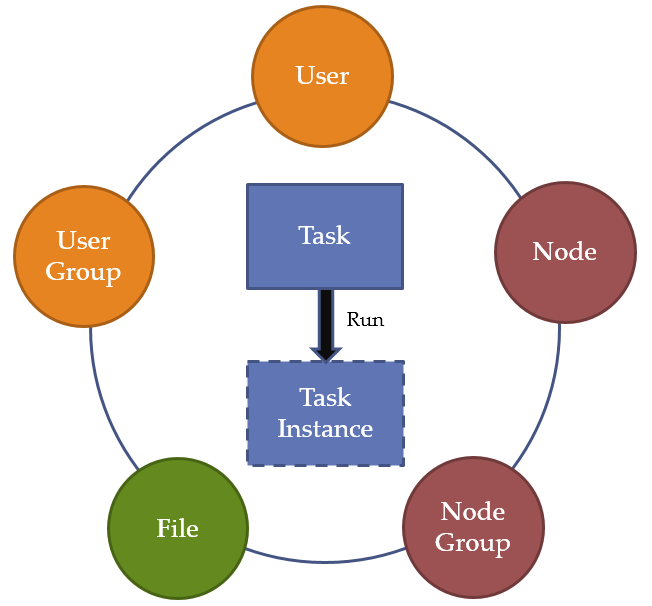

[목차](UserManual.md) / [다음페이지](UserManual2.md)

## OPMATE 란?
**OPMATE**는 *Operator`s Mate* 또는 *Operation Automation* 이라는 중의적 의미를 가지며, 
동일한 스크립트를 여러 노드에 실행 시키고 결과를 확인하기 위한 솔루션이다.

사용자는 OPMATE CLI(Command Line Interface) 등을 통해서
OPMATE 에이전트가 설치된 각각의 호스트(Host)에 수행할 작업을 사전 정의하고 일괄 수행할 수 있다.

사용자는 반복적이고 위험할 수 있는 작업을 OPMATE를 통해 사전에 정의/검토하여 일괄 수행함으로서 안정적이고 효율적으로 수행/관리 할 수 있게된다.

아래 그림에서는 Disk 의 정보를 확인하는 Unix/Linux 의 "df" 명령을 수행하는 스크립트를 작성 및 일괄 수행하고 있다.
물론, 결과 또한 각각의 호스트(Host)에 개별 접속하지 않고 OPMATE CLI 등을 통해서 확인 가능하다.
 

## OPMATE 의 객체
OPMATE 는 아래 그림에 나타낸 객체 들의 조합을 통해 TASK를 정의하고 수행한다.

| **객체**      | **설명** |
| ------------- | ----------------------------------------------------------------- |
| User          | 사용자는 OPMATE를 사용하기 위한 계정이며, 역할에 따라 수행 가능한 작업의 범위가 달라진다. |
| User Group    | 사용자그룹은 여러명의 사용자 집합이다. 다수의 사용자들을 동시에 지정하는 용도로 사용한다. |
| Node          | 노드는 에이전트가 설치되어 있는 운영관리의 대상이 되는 호스트(Host)이다. | 
| Node Group    | 노드그룹은 여러 노드가 모여 있는 집합이다. 다수의 노드들을 동시에 지정하는 용도로 사용된다. |
| Task          | 태스크는 하나 이상의 노드를 대상으로 동일한 작업(스크립트)을 동시에 실행하기 위한 작업 정의서이다. |
| Task Instance | 태스크인스턴스는 태스크 실행시 생성되며 실행에 관련된 각종 정보를 가지고 있다. |
| File          | 파일은 Master 리파지토리의 파일을 의미하며, 에이전트로부터 수집되거나 또는 에이전트에 배포된다. |  

각각의 객체에 대한 자세한 설명은 다음 장에서 설명한다.

<!-- Floating Menu -->
<link rel="stylesheet" type="text/css" href="/assets/css/common.css" />

	<ul>
		<!--li><a href="#">이전</a></li-->
		<li><a href="#">목차</a>
			<ul>
				<li><a href="UserManual1.html">1. 개요</a></li>
				<li><a href="UserManual2.html">2. 사용자</a></li>
				<li><a href="UserManual3.html">3. 사용자 그룹</a></li>
				<li><a href="UserManual4.html">4. 노드</a></li>
				<li><a href="UserManual5.html">5. 노드 그룹</a></li>
				<li><a href="UserManual6.html">6. 태스크</a></li>
				<li><a href="UserManual7.html">7. 태스크 인스턴스</a></li>
				<li><a href="UserManual8.html">8. 파일 배포/수집</a></li>
				<li><a href="UserManual9.html">[별첨 #1] CLI 사용법</a></li>
				<li><a href="UserManual10.html">[별첨 #2] 스크립트내 예약어</a></li>
			</ul>
		</li>
		<!--li><a href="#">다음</a></li-->
	</ul>

[목차](UserManual.md) / [다음페이지](UserManual2.md)