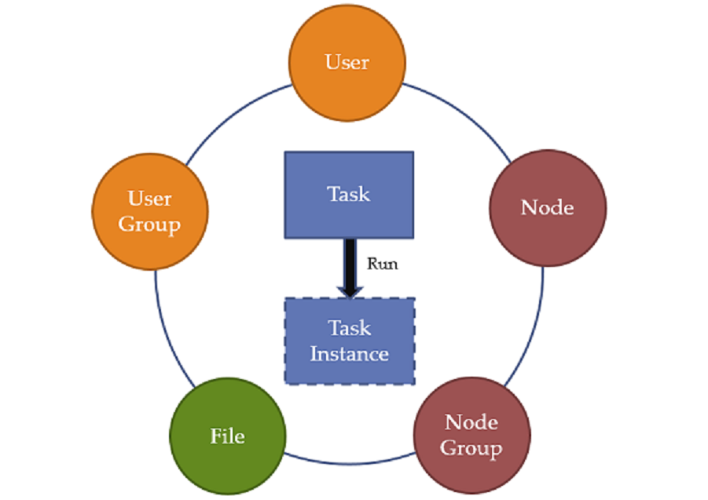

[목차](UserManual.md) / [다음페이지](UserManual2.md)

## OPMATE 란?
동일한 스크립트를 여러 노드에 실행 시키고 결과를 확인

## OPMATE 의 객체
OPMATE 는 아래 그림에 나타낸 객체 들의 조합을 통해 TASK를 정의하고 수행한다.

[목차](UserManual.md) / [다음페이지](UserManual2.md)