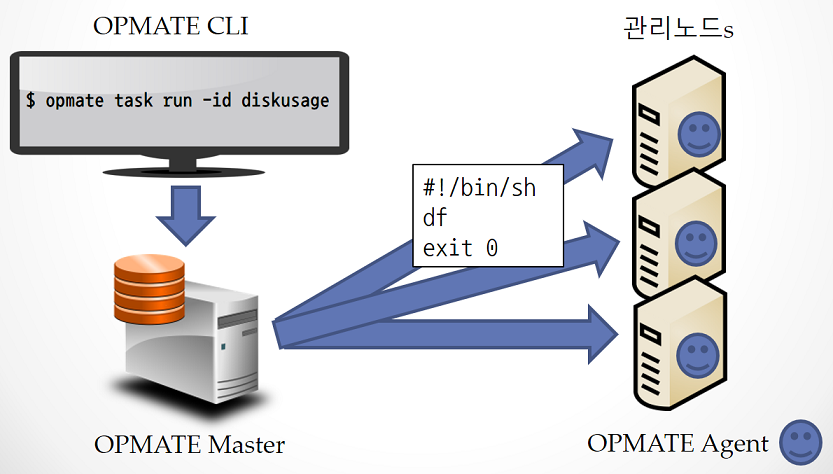

[목차](UserManual.md) / [다음페이지](UserManual2.md)

## OPMATE 란?
OPMATE는 동일한 스크립트를 여러 노드에 실행 시키고 결과를 확인하기 위한 솔루션이다.

사용자는 OPMATE CLI(Command Line Interface) 등을 통해서
OPMATE Agent 가 설치된 각각의 Host(Server)에 수행할 작업을 사전 정의하고 일괄 수행할 수 있다.

사용자는 반복적이고 위험할 수 있는 작업을 OPMATE를 통해 사전에 정의/검토하여 일괄 수행함으로서
안정적이고 효율적으로 수행/관리 할 수 있게된다.

아래 그림에서는 Disk 의 정보를 확인하는 Unix/Linux 의 "df" 명령을 수행하는 스크립트를 작성 및 일괄 수행하고 있다.
물론, 결과 또한 각각의 Host에 개별 접속하지 않고 OPMATE CLI 등을 통해서 확인 가능하다.
 

## OPMATE 의 객체
OPMATE 는 아래 그림에 나타낸 객체 들의 조합을 통해 TASK를 정의하고 수행한다.

| 
property\*\*객체\*\*
 | \*\*설명\*\* |
| ---------- | ----------------------------------------------------------------- |
| User(사용자) | OPMATE를 사용할 수 있는 사용자의 계정이며, 역할에 따라 수행 가능한 작업의 범위가 달라진다. |
| User Group(사용자 그룹) | 여러명의 사용자가 모여 있는 집합이다. 다수의 사용자들을 동시에 지정하는 용도 등으로 사용된다. |

각각의 객체에 대한 자세한 설명은 다음 장에서 설명한다.

[목차](UserManual.md) / [다음페이지](UserManual2.md)