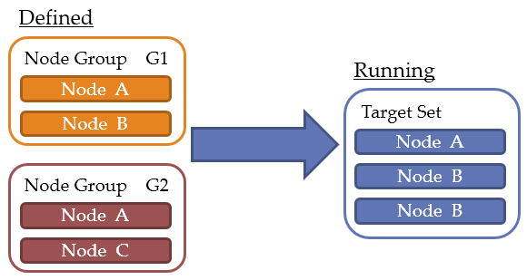

[목차](UserManual.md) / [이전페이지](UserManual5.md) / [다음페이지](UserManual7.md)

## 태스크 (Task)

태스크는 하나 이상의 노드를 대상으로 동일한 작업(스크립트)을 동시에 실행하기 위한 작업 정의서이다.

태스크의 생성은 작업자 이상의 권한을 가지고 있으면 가능하고, 생성한 사용자가 해당 태스크의 소유자(Owner)가 된다.

소유자는 태스크 정의를 변경하거나 삭제할 수 있으며, 소유자를 다른 사용자로 변경할 수도 있다.

태스크의 주요 구성 정보는 다음과 같다.
> 태스크ID, 스크립트(Script), 대상 노드(Target Node), 스케쥴(Schedule), 실행 방식, 실행 권한, 다음 태스크(Next Task), 소유자(Owner)

```
$ opmate task view -id diskusage

+-------------------+---------------------------------+
| FIELD             | VALUE                           |
+-------------------+---------------------------------+
| [BASIS]           |                                 |
|                   |                                 |
| ID                | diskusage                       | ☜  태스크ID
| REVISION          | 6                               |
| OWNER             | bumbee                          | ☜  소유자(Owner)
| SCRIPT            | diskusage.sh                    | ☜  스크립트(Script)
| OS USER           | root                            |
| BY SCHEDULER      | enable                          | ☜  실행 방식
| BY ONDEMAND       | enable                          | ☜  실행 방식
| BY TASK           | disable                         | ☜  실행 방식
| NEXT TASK         |                                 | ☜  다음 태스크(Next Task)
| DESCRIPTION       | check disk space usage          |
| CREATED AT        | 2020/02/28 16:48                |
| CREATED BY        | bumbee                          |
| UPDATED AT        | 2020/03/02 10:21                |
| UPDATED BY        | bumbee                          |
|                   |                                 |
| [APPROVAL]        |                                 |
|                   |                                 |
| STATUS            | approved                        |
| REQ REASON        |                                 |
| RJT REASON        |                                 |
| APPROVER          | oprim                           |
| UPDATED AT        | 2020/03/02 10:55                |
|                   |                                 |
| [SCHEDULES]       |                                 | ☜  스케쥴(Schedule)
|                   | yearly01(yearly, */01/01 01:20) |
|                   |                                 |
| [RUNNERS]         |                                 | ☜  실행 권한
|                   | oprim(user)                     |
|                   |                                 |
| [TARGETS]         |                                 | ☜  대상 노드(Target Node)
|                   | linux_tomcat(node-group)        |
+-------------------+---------------------------------+
```

### 스크립트 (Script)

스크립트가 기술된 파일(bash 쉘스크립트 파일 등)과 해당 스크립트를 실행할 사용자명(OS의 계정명)을 등록한다.

스크립트는 태스크를 수행할 노드의 OS종류에 따라서, *쉘스크립트/배치스크립트/Powershell/VBS* 등으로 작성한다.
작성된 스크립트는 (OPMATE 에 사전 등록된) 특정 커맨드를 포함하고 있는 지의 여부도 검사 가능하다.

형상관리와 유사하게 태스크의 이전 버전 스크립트 뿐만 아니라, 다른 사용자의 태스크에 등록된 스크립트도 확인 가능하다.

### 대상 노드 (Target Node)

태스크가 실행되기 원하는 대상 노드를 지정한다.

노드 또는 노드 그룹으로 추가할 수 있으며, 노드와 노드 그룹을 혼용하여 지정할 수도 있다. 
*(노드 A가 노드 그룹 G1/G2에 모두 속해 있더라도, 태스크에 노드 그룹 G1/G2를 지정할 수 있다.)* 

아래의 그림은 사용자가 지정한 대상에 대해서, OPMATE가 실제 태스크 수행시에 대상을 어떻게 관리하는지 보여주고 있다.

사용자는 노드그룹 G1/G2를 태스크의 대상으로 지정했으며, 두 개의 노드그룹에서 노드A는 중복 지정되어 있다.*(그림 좌측)*
이러한 경우, OPMATE는 태스크의 수행 대상 노드를 합집합의 형태로 관리하게 된다.*(그림 우측)*



### 스케쥴 (Schedule)

태스크가 자동으로 실행될 시점을 정의한다. 
다음과 같이 주기에 따른 값을 지정할 수 있다.

| 주기 | 지정값                                | 비고                          |
| --- | ---------------------- | ----------------- |
| 매시 | mm분                                  | mm : 00 ~ 59      |
| 매일 | hh시 mm분                           | hh : 00 ~ 23      |
| 매주 | WWW hh시 mm분                    | WWW : sun\|mon\|tue\|wed\|thu\|fri\|sat |
| 매월 | DD일 hh시 mm분                    | DD : 01 ~ 31      |
| 매년 | MM월 DD일 hh시 mm분             | MM : 01 ~ 12      |
| 한번 | YYYY년 MM월 DD일 hh시 mm분  | YYYY : 2000~9999  |

하나의 태스크에는 하나 이상의 스케줄을 지정할 수 있다. 

예를 들면, 분기에 한 번 수행하는 태스크가 있다면 아래와 같이 4개의 스케줄을 지정하여 처리 가능하다.

- quarter01 : (매년)03월 31일 01시 00분
- quarter02 : (매년)06월 30일 01시 00분
- quarter03 : (매년)09월 30일 01시 00분
- quarter04 : (매년)12월 31일 01시 00분

### 실행 방식

태스크를 실행하는 방식은 다음 3가지이며, 각각 활성화(enable)/비활성화(disable) 할 수 있다.

- **By 스케쥴러**
  - 등록된 스케쥴에 의해서 실행되는 방식
- **By 온디맨드**
  - 사용자가 직접 명령하여 바로 실행되는 방식
- **By 태스크**
  - 다른 태스크가 다음 태스크(Next Task)로 지정하여 실행되는 방식

### 실행 권한

사용자에 의한 온디맨드 실행방식과 다른 태스크에 의한 실행방식은 **실행주체**를 정의해줘야 실행이 가능해진다.
실행주체는 사용자(User), 사용자그룹(User Group), 태스크(Task)가 대상이 될 수 있다.
단, 태스크의 소유자(Owner)는 별도로 부여하지 않아도 실행이 가능하다.

### 실행

사용자에 의해서 정의되고, 검토자에 의해서 승인되면 태스크는 실행을 위한 모든 절차가 완료된다. 

태스크의 실행은 위의 실행 방식 절에서 설명한 것과 같이 수행할 수 있으며,<br> 
사용자가 태스크를 실행하는 온디맨드의 경우는 사전에 지정된 대상 노드 중에 일부만을 실행 시점에 지정하여 실행하거나 스크립트에 명령행 인자를 전달할 수도 있다.

태스크의 정의와 그에 대한 승인이 완료되면 사용자는 OPMATE 의  CLI를 통해서 아래와 같이 태스크를 실행 할 수 있다.
*(온디멘드 수행을 가능하도록 정의한 경우)*

```
$ opmate task run -id diskusage
task-instance #71 has been created successfully.

$ opmate task run -id diskusage -ni linux01
task-instance #72 has been created successfully.
```

위 예제에서는 *diskusage* 라는 ID의 동일한 태스크를 2회에 걸쳐서 수행하고 있다.
첫 번째 수행에서는 태스크의 타겟으로 정의한 모든 노드에 대해서 수행하고, 두 번째 수행에서는 특정 노드에 대해서만 수행하고 있다.

실행 결과에서 보여지듯이 71,72번의 태스크 인스턴스가 성공적으로 생성되었다고 사용자에게 보고하고 있다.
태스크를 수행하는 경우 태스크 인스턴스가 생성되며 사용자는 이에 대한 내용(태스크 수행과 관련한 상태)을 다음 절에서 설명할 태스크 인스턴스 객체의 조작을 통해 확인할 수 있다.

### 다음 태스크 (Next Task)

태스크 실행이 정상적으로 완료(모든 타겟노드의 실행결과가 성공)된 후 자동으로 다른 태스크가 실행되도록 하고 싶을 경우에 지정한다.

단, 호출되는 태스크에서 실행 권한을 부여해줘야 한다.
예를 들어, A태스크가 B태스크를 Next Task로 실행하고자 한다면, B태스크의 권한설정에 A태스크를 실행 가능 태스크로 추가해야 한다.

### 승인(Approval)과 리비젼(Revision)

신규로 추가되거나, 변경된 태스크는 작업본(리비젼 번호 0) 상태로만 존재하고, 실제로 실행되기 위해서는 승인 과정을 거쳐야 한다.

승인은 태스크의 소유자가 검토자 권한을 가진 사용자에게 요청한다.

검토자는 승인 요청을 확인하고, 승인 또는 거절을 할 수 있다.
이 과정에서 태스크의 정의(스크립트/대상 노드 등)를 **Cross-Check**하여, 작업 위험을 감소시킬 수 있다.

검토자에 의해 승인된 태스크는 리비젼 번호가 갱신된다. 리비젼 번호는 1부터 시작하며 승인시마다 1씩 증가한다.

태스크의 리비젼 목록을 조회할 수 있으며, 리비젼 번호를 지정하여 해당 리비젼의 태스크 정의를 조회할 수 있다.

[목차](UserManual.md) / [이전페이지](UserManual5.md) / [다음페이지](UserManual7.md)