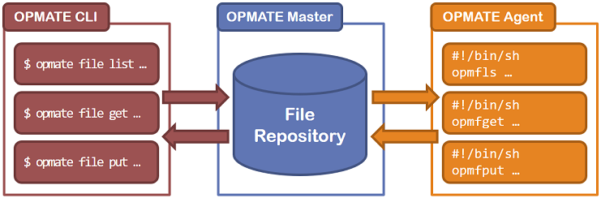

[목차](UserManual.md) / [이전페이지](UserManual7.md) / [다음페이지](UserManual.md)

## 파일 배포/수집



사용자는 휘발성 임시 공간을 활용하여 파일을 배포하거나 수집할 수 있다.
보관의 용도가 아닌, 대량의 파일 수집과 배포를 위한 용도이다.

# 예시

user1 계정이 1.txt 파일을 현재 작업 공간에서 임시 공간에 올린다.

```$ opmate file put -rp master:/user1/1.txt -lp ./1.txt ```

임시 공간에 올린 파일을 확인한다.

```$ opmate file list -rp master:/user1/1.txt ```

임시 공간에 올린 파일을 로컬 경로 (/temp) 로 내린다.

```$ opmate file get -rp master:/user/1.txt -lp /temp/1.txt ```


[목차](UserManual.md) / [이전페이지](UserManual7.md) / [다음페이지](UserManual.md)