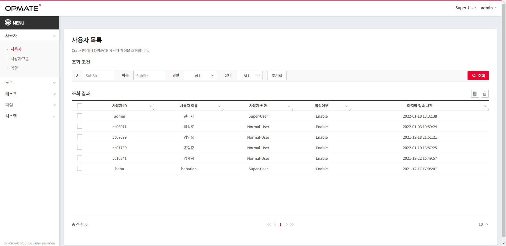

## 사용자 목록
OPMATE 사용자 정보를 조회하고, 삭제할 수 있다.

>

{: width="100px" height="100px" }

.baba {
    vertical-align: bottom;
}

1. 권한
    - 조회 : All-User  
    - 삭제 : Super-User
2. 조회 조건
    - 사용자 ID : 부분문자열 조회 가능  
    - 사용자 이름 : 부분문자열 조회 가능  
    - 권한 : ALL/Super-User/Normal-User 선택  
    - 상태 : ALL/Enable/Disable 선택  
    - `초기화` : 조회 조건 초기화  
    - `조회` : 조회 수행  
    - {: style="vertical-align: bottom;" } : 조회 수행  
    - {: width="65px" } : 조회 수행  
    - {: width="65px" style="vertical-align: bottom;" } : 조회 수행
    - {: style="vertical-align: bottom;" } : 조회 수행
    - {: width="65px" } : 조회 수행
    - {: width="65px" style="vertical-align: bottom;" } : 조회 수행
    - <kbd>초기화</kbd> : 조회 조건 초기화
    - <kbd style="color: #ffffff; background-color: #ea0530; box-shadow: 0px 2px 1px 1px #ea9999">조회</kbd> : 조회 수행  
3. 조회 결과
    - Grid : 조회 조건에 해당하는 결과를 출력한다.  
    >`Double Click` : Row 를 Doub   le Click 하면 해당 사용자의 상세 정보 화면으로 이동한다.(권한에 따른 편집가능)  
    - Grid 상단  
    >  : Check 된 Row 를 삭제한다.   
       : 신규 생성한다.
    - Grid 하단  
    > Left : 조회 건수  
    Center : 페이지 표시/선택  
    Right : Grid 에 한번에 표시할 건수  

## 사용자 정보

- 기본정보
    - [x] 사용자ID
    - [ ] 설명