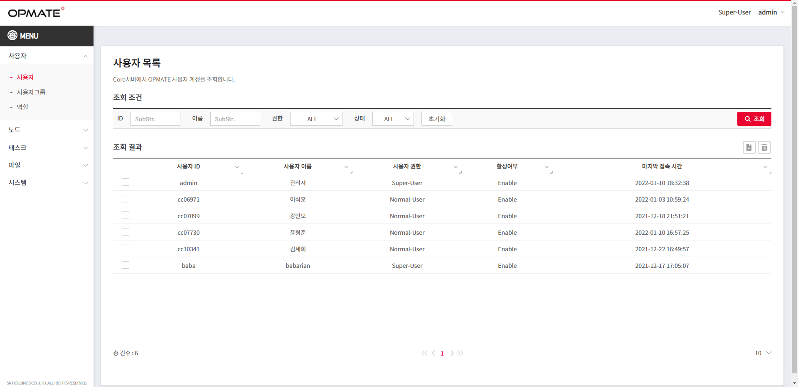

## 사용자 목록
OPMATE 사용자 정보를 조회하고, 삭제할 수 있다.

>

<!--
{: width="100px" height="100px" } 
-->

### 권한
모든 사용자가 조회 기능을 사용할 수 있지만,  
<mark style='background-color: red'><b>삭제 기능</b></mark>은 <b><u>Super-User 권한의 사용자</u></b>만 사용 가능 하다.  
<b>삭제 기능</b>은 <u><b>Super-User 권한의 사용자</b></u>만 사용 가능 하다.

### 조회 조건
>사용자 ID : 부분문자열 조회 가능  
사용자 이름 : 부분문자열 조회 가능  
권한 : ALL/Super-User/Normal-User 선택  
상태 : ALL/Enable/Disable 선택   
<mark style='background-color: #ea0530'>　초기화　</mark> : 조회 조건 초기화  
<mark style='background-color: #ea0530'>　조회　</mark> : 조회 수행  

><b>초기화</b> : 조회 조건 초기화  
<b>조회</b> : 조회 수행
 
### 조회 결과
#### Grid : 조회 조건에 해당하는 결과를 출력한다.  
>`Double Click` : Row 를 Double Click 하면 해당 사용자의 상세 정보 화면으로 이동한다.  
(권한에 따른 편집가능)  
 
#### Grid 상단  
>  : Check 된 Row 를 삭제한다.   
 : 신규 생성한다.
 
#### Grid 하단  
> Left : 조회 건수  
Center : 페이지 표시/선택  
Right : Grid 에 한번에 표시할 건수  

> Left : 조회 건수 :     
Center : 페이지 표시/선택 :     
Right : Grid에 한 번에 표시할 건수 :     

## 사용자 정보
사용자 상세정보 확인, 등록, 수정이 가능합니다.

>

### 기본정보
>- 사용자ID    
   >> - 허용 문자 내에서 ID 편집 가능. (20자 미만)
   >> - `확인` 버튼으로 중복여부 확인 가능.
 - 이름
     - 허용 문자 내에서 이름 편집 가능. (30자 미만)
 - 권한
     - Normal-User/Super-User 적용 가능.
     - Super-User 인 경우만 활성화.
 - Noti(이메일)
     - 이메일 형식에 맞게 입력. (50자 미만)
 - 연락처
     - 연락처 입력 (50자 미만)
 - 상세사항
     - 상세사항 입력 (500자 미만)

### 계정상태
>   - 활성여부
        - Enable/Disable 적용 가능.
        - Super-User 인 경우만 활성화.

### 비밀번호
>

### 이력정보
>